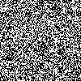
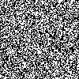
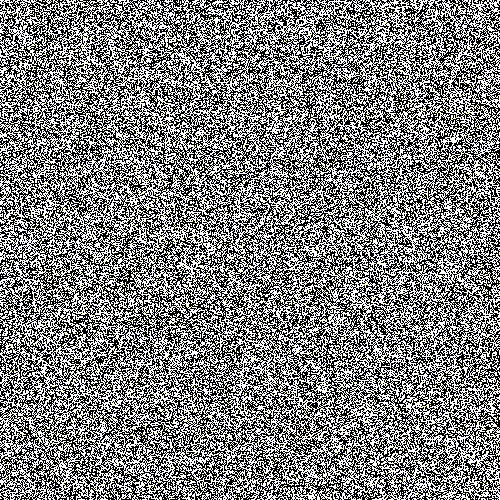
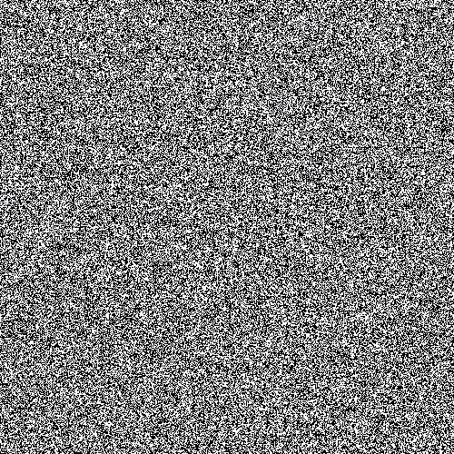

# IsingModel-Visual
A simulation of the 2D Ising Model. In particular, this program produces a video of the evolution of the 
Ising model using both the Metropolis-Hastings Algorithm and the Wolff Algorithm.

## Examples

<table style="width:100%">
  <tr>
    <th>Metropolis-Hastings</th>
    <th>Wolff</th>
  </tr>
    <tr>
    <td>400 Steps/Frame</td>
    <td>2 Steps/Frame</td>
  </tr>
  <tr>
    <td></td>
    <td></td>
  </tr>
    <tr>
    <td>25000 Steps/Frame</td>
    <td>64 Steps/Frame</td>
  </tr>
    <tr>
    <td></td>
    <td></td>
  </tr>
</table>

## Known Bugs
When given non-square dimensions, this program produces 'interesting' visual glitches, they seem to be something to do 
with selecting/iterating through the bounded indices?
