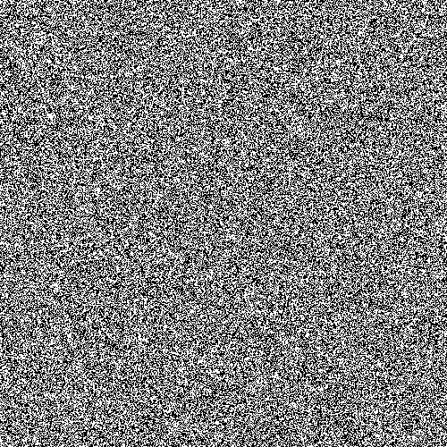
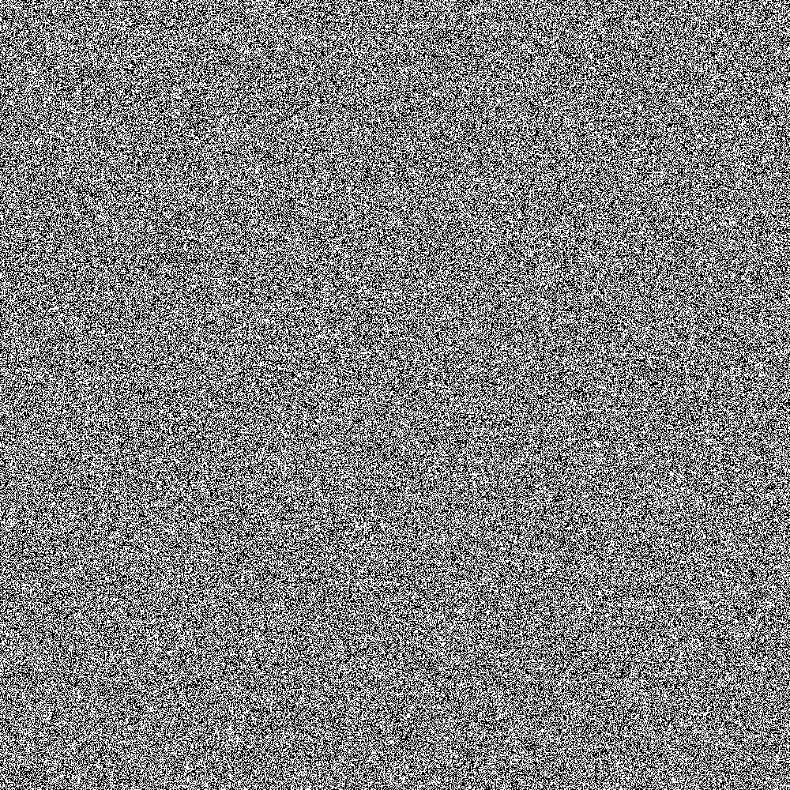
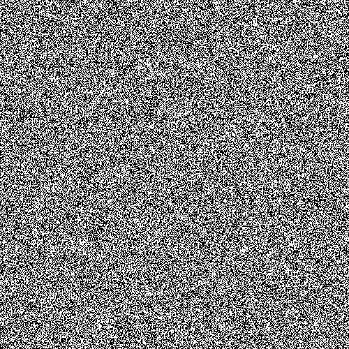
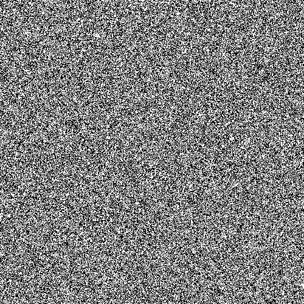
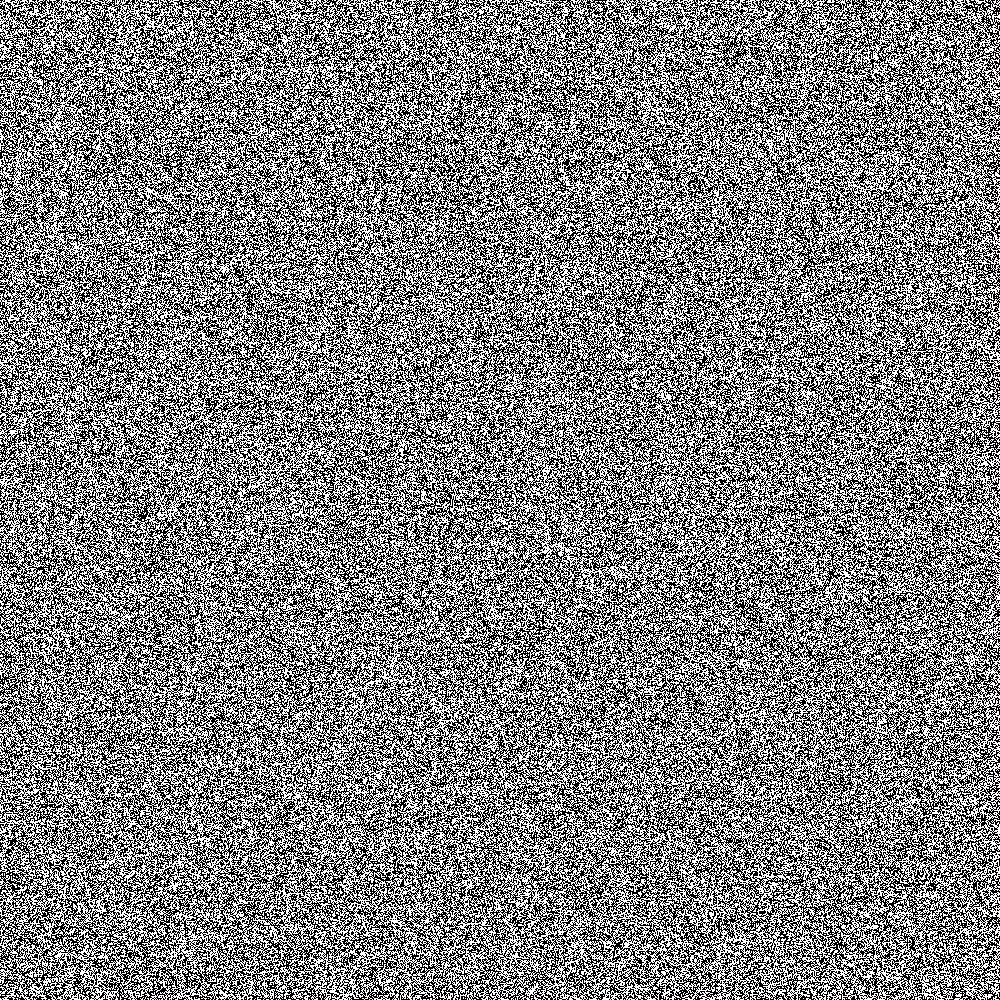

# IsingModel-Visual
A simulation of the 2D Ising Model. In particular, this program produces a video of the evolution of the 
Ising model using both the Metropolis-Hastings Algorithm and the Wolff Algorithm.

## Examples

<table style="width:100%">

  <tr>
    <th>Metropolis-Hastings   Square Geometry</th>
    <th>Wolff   Square Geometry</th>
  </tr>

  <tr>
    <td>
    <figure>
      
      <figcaption>
Fig.1a - 500x500 Grid, 1000 Steps/Frame
</figcaption>
    </figure>
    </td>
    <td>
    <figure>
          
          <figcaption>
Fig.1b - 500x500 Grid, 400 Steps/Frame
</figcaption>
        </figure>
    </td>
  </tr>

  <tr>
    <td>
    <figure>
      
      <figcaption>
Fig.1 - 1000x1000 Grid, 1000 Steps/Frame
</figcaption>
    </figure>
    </td>
    <td>
    <figure>
          
          <figcaption>
Fig.2 - 1000x1000 Grid, 1500 Steps/Frame
</figcaption>
        </figure>
    </td>
  </tr>
  <tr>
    <th>Metropolis-Hastings   Hexagonal Geometry</th>
    <th>Wolff   Hexagonal Geometry</th>
  </tr>
    <tr>
  </tr>
    <tr>
    <td>
        <figure>
          
          <figcaption>
Fig.3 - 500x500 Grid, 1000 Steps/Frame
</figcaption>
        </figure>
    </td>
    <td>
        <figure>
              
              <figcaption>
Fig.4 - 500x500 Grid, 40 Steps/Frame
</figcaption>
            </figure>
    </td>
  </tr>
    <tr>
  </tr>
    <tr>
    <td>
        <figure>
          
          <figcaption>
Fig.3 - 1000x1000 Grid, 1000 Steps/Frame
</figcaption>
        </figure>
    </td>
    <td>
        <figure>
              
              <figcaption>
Fig.4 - 1000x1000 Grid, 100 Steps/Frame
</figcaption>
            </figure>
    </td>
  </tr>
</table>

## Known Bugs
When given non-square dimensions, this program produces 'interesting' visual glitches, they seem to be something to do 
with selecting/iterating through the bounded indices?
