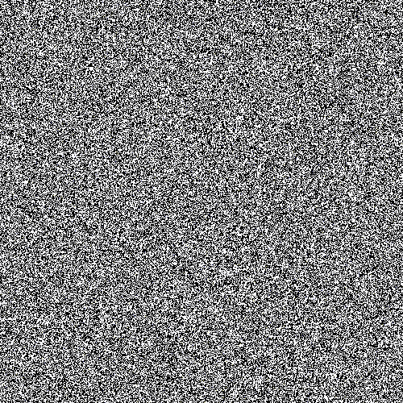
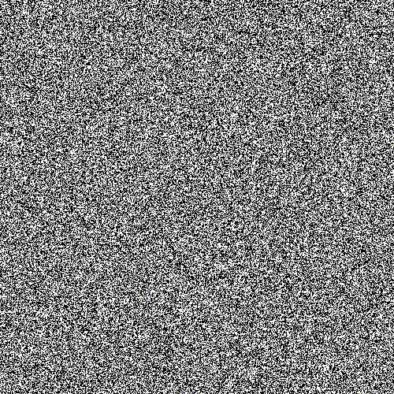
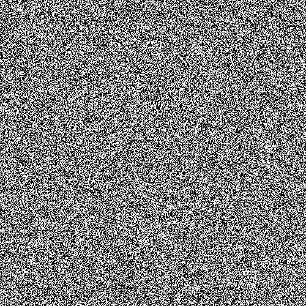
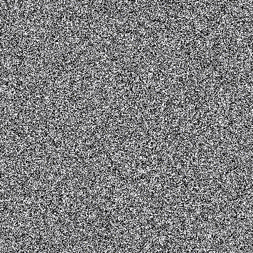

# IsingModel-Visual-C
A pure C implementation of the 2D Ising Model. In particular, this program produces a video of the evolution of the 
Ising model using the Metropolis-Hastings Algorithm.

<!--
## Examples
|     |     |
| --- | --- |
|  1000 frames, 250000 iterations between each frame| 1000 frames, 250000 iterations between each frame|
|  1000 frames, 250000 iterations between each frame| 1000 frames, 250000 iterations between each frame|
-->

## Examples
|     |     |
| --- | --- |
|  1000 frames, 31250 iterations between each frame|  1000 frames, 62500 iterations between each frame|
|  1000 frames, 125000 iterations between each frame|  1000 frames, 250000 iterations between each frame|

## Known Bugs
When given non-square dimensions, this program produces 'interesting' visual glitches, they seem to be something to do 
with selecting/iterating through the bounded indices?